# 🛒 Shopping Store

A full-stack e-commerce web application built with **ASP.NET Core MVC**, **Entity Framework Core**, and **ASP.NET Identity**. Shopping Store provides a complete shopping experience — from browsing products to placing orders — alongside a powerful admin panel for managing the entire catalog and order pipeline.

---

## ✨ Features Overview

**Customer**
- Secure registration and login with email/password or Google OAuth
- Browse products with category filtering, search, sorting, and pagination
- Add to cart with dynamic quantity updates and live price calculation
- Checkout with saved or new shipping addresses
- View order history with real-time status timeline
- Cancel pending orders

**Admin**
- Dashboard with live stats — revenue, orders, customers, low stock alerts
- Full CRUD for categories (with parent/child hierarchy)
- Full CRUD for products (with image file upload or URL)
- Order management with status updates (Pending → Processing → Shipped → Delivered → Cancelled)

---

## 🔐 Authentication

Supports both standard email/password registration and Google OAuth sign-in. All non-landing pages require authentication.

### Email / Password
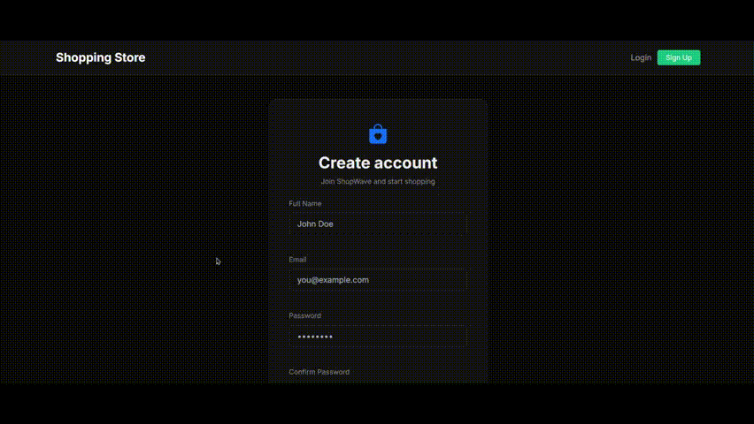

### Google OAuth
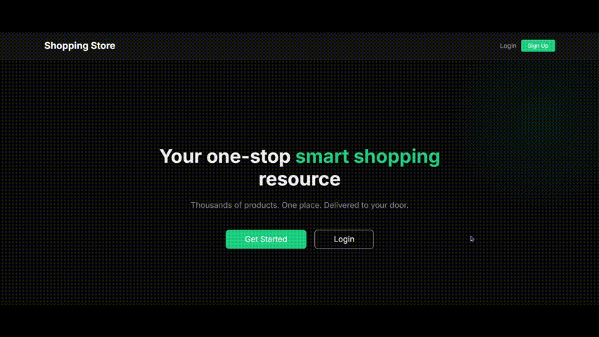

---

## 🗂️ User Flow

### 1. Browse the Catalog

Filter by category in the sidebar, paginate through results, and sort by name, newest, price high-to-low, or price low-to-high.

**Pagination & Categories**

**Sorting**
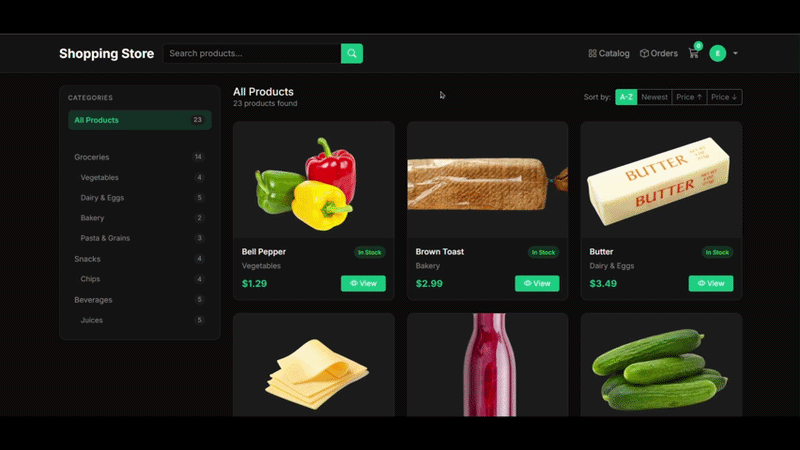

**Search**
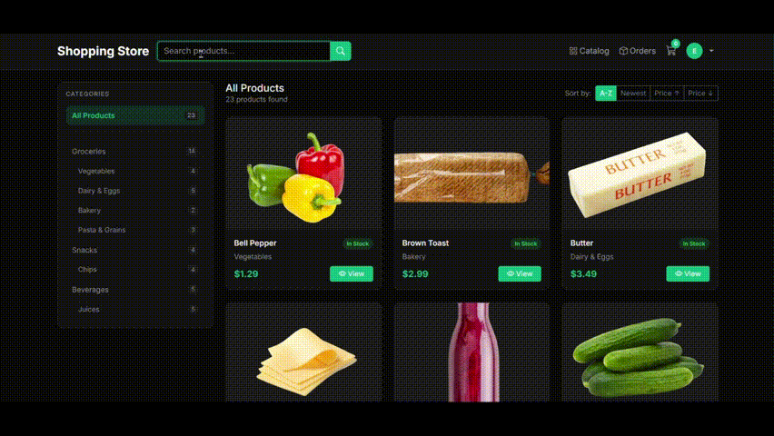

---

### 2. Add to Cart

From any product details page, select a quantity and add to cart. The cart badge in the navbar updates instantly.

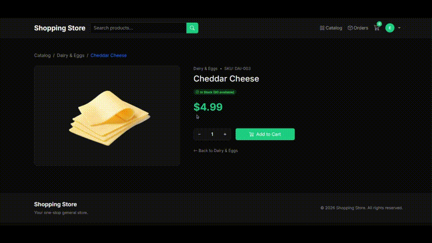

---

### 3. Manage Cart

Adjust item quantities dynamically — prices update in real time. Remove items directly from the cart.

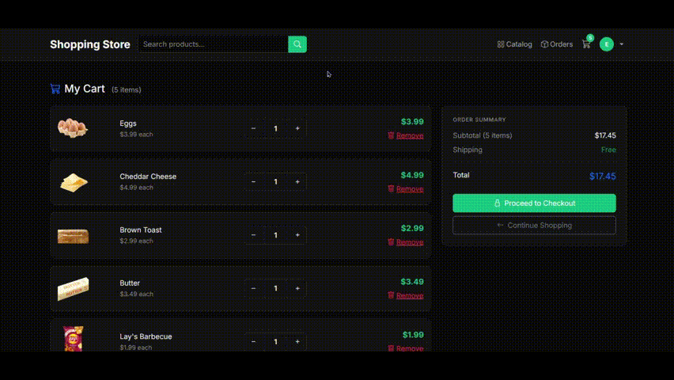

---

### 4. Checkout

Proceed to checkout and select a saved shipping address or enter a new one. New addresses can optionally be saved for future orders.

**First-time Checkout**
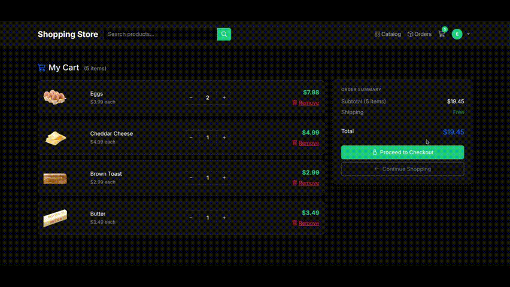

**Returning with Saved Address**
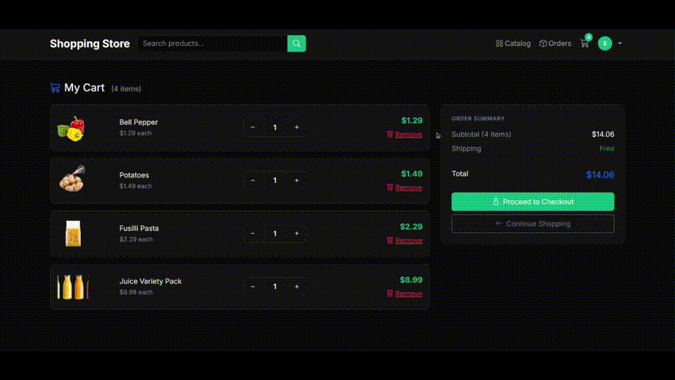

---

### 5. Track Orders

After placing an order, view a full order details page with an item breakdown, shipping address, and a live status timeline. Pending orders can be cancelled directly.
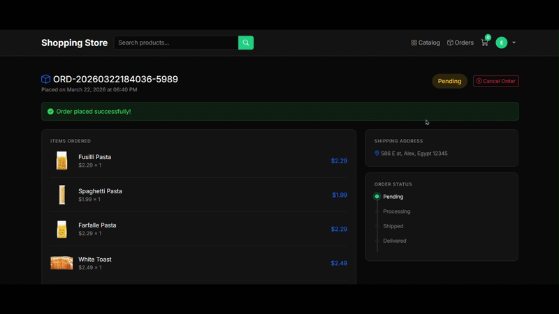

---

## 🛠️ Admin Features

### Dashboard

Overview of total products, orders, customers, and revenue — plus pending order alerts and low stock warnings.

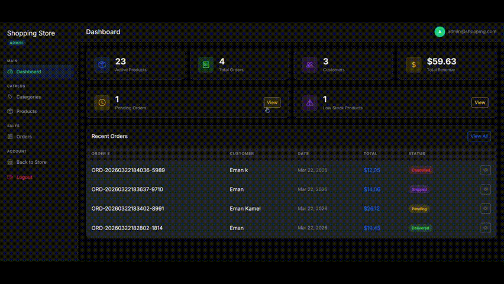

**Order Visibility**
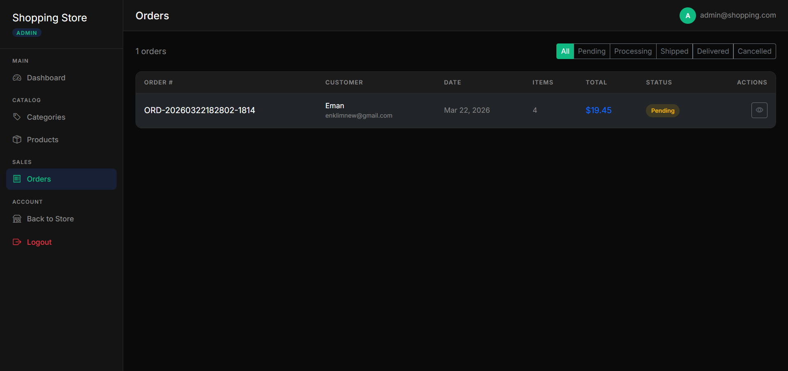

---

### Category Management

Create, edit, and delete categories. Supports one level of parent/child nesting (e.g. Groceries → Vegetables).

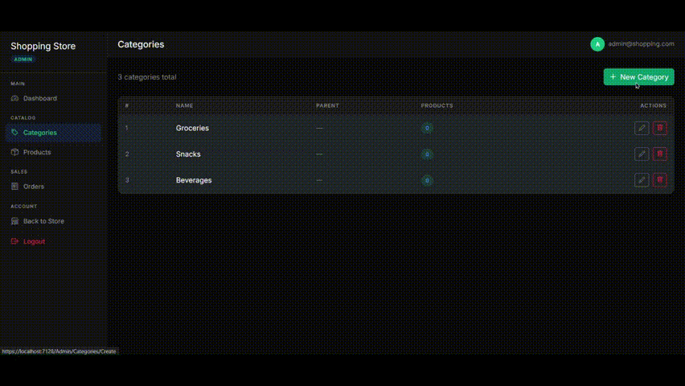

---

### Product Management

Create and edit products with image file upload or URL input, category assignment, stock tracking, and active/inactive toggling. Products with order history are soft-deleted to preserve data integrity.

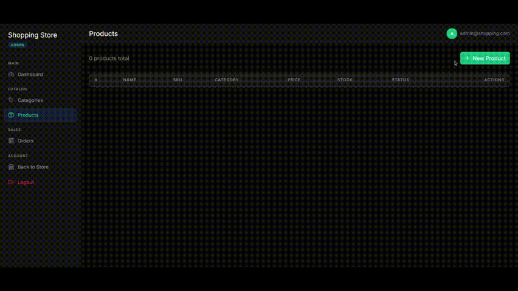

---

### Order Management

View all orders with status filtering. Update any order's status from the details page — cancellations automatically restore stock.

---
## 🧰 Tech Stack
 
| Layer | Technology |
|---|---|
| Framework | ASP.NET Core MVC 8 |
| ORM | Entity Framework Core 8 |
| Auth | ASP.NET Identity + Google OAuth |
| Database | SQL Server |
| Frontend | Bootstrap 5, Bootstrap Icons, jQuery Validation |
| Architecture | Repository Pattern + Service Layer |
 
